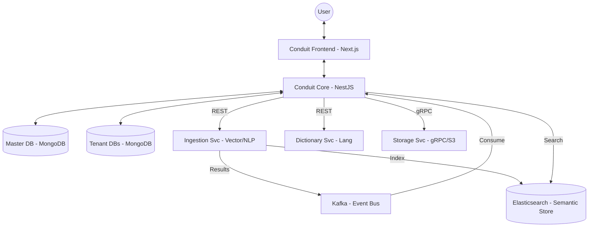
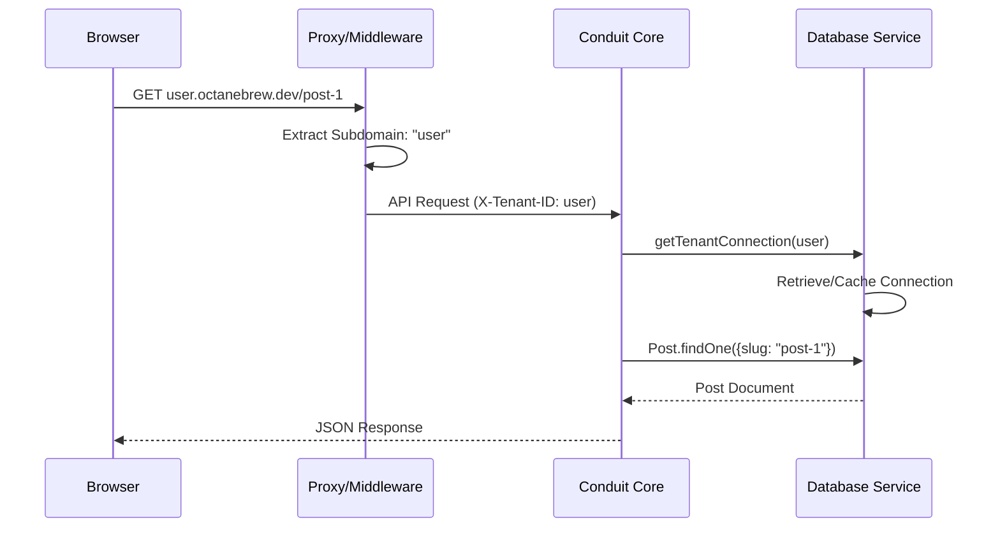

# Architecture Specification — Conduit

## 1. Overview
Conduit is a multi-tenant text publishing platform designed for high-scale content creation and discovery. It leverages a **Database-per-Tenant** architecture to ensure strict data isolation and performance predictability. The system is divided into a **Fluidic UI** frontend and a **Nested Module** backend, integrated via high-performance microservices (Search, Storage, Dictionary).

---

## 2. System Architecture Model

### 2.1 High-Level Component Interaction
The following diagram illustrates the relationship between the core platform elements and external specialized services.

---

## 3. High-Performance Multi-Tenancy

Conduit utilizes a sophisticated multi-tenancy model to handle thousands of independent creators within a unified discovery network.

### 3.1 Tenant Resolution Flow
How the system identifies the context and switches databases in real-time.

### 3.2 Data Sovereignty Model
- **Isolation Level**: Database-level (Dedicated MongoDB databases per tenant).
- **Scalability**: Allows horizontal scaling of databases across clusters without cross-talk risk.
- **Aggregated Discovery**: The `global_feed` in the master database stores minimal metadata for cross-tenant discovery while maintaining the heavy content in tenant-specific storage.

---

## 4. Complex Subsystems

### 4.1 Hybrid Search & Enrichment
Traditional keyword search is augmented by a vector-based semantic engine.
1.  **Publish Event**: User publishes a post.
2.  **Ingestion**: Core pushes raw text to the Ingestion Service.
3.  **Semantic Analysis**: Ingestion service generates embeddings and extracts entities/concepts.
4.  **Async Feedback**: Results are published to Kafka; Core consumes them to update the `Post` document with `summary`, `entities`, and `keyConcepts`.

### 4.2 Storage & Identity Service (gRPC)
Decoupled media handling via gRPC allows the system to remain storage-agnostic. The `StorageService` manages secure uploads, resizing, and CDN invalidation.

### 4.3 Multi-Language Dictionary Processor
A specialized subsystem for Japanese literary synthesis (Furigana, Readings) and English definitions, ensuring high-quality typography across different language contexts.

---

## 5. Performance Strategy

| Layer | Strategy | Rationale |
| :--- | :--- | :--- |
| **Frontend** | ISR (Incremental Static Regeneration) | Near-static speeds with dynamic background updates for posts. |
| **Backend** | Connection Pooling/Caching | `DatabaseService` caches Mongoose connections to minimize handshake latency. |
| **Database** | MongoDB Atlas | Distributed document storage with auto-scale. |
| **Search Engine** | Elasticsearch | Semantic vector store and full-text indexing provider. |
| **Events** | Confluent Kafka | High-throughput asynchronous orchestration. |
| **Asset** | gRPC Stream | Efficient binary data transfer for large media uploads. |
