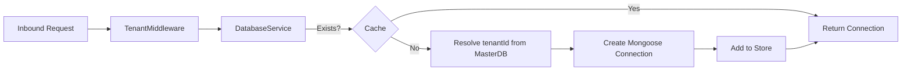

# Backend Specification — Conduit Core

## 1. System Structure

Conduit Core is built as a modular NestJS application, ensuring clear boundaries between domains.

### 1.1 Directory Topology
```text
conduit-core/
├── src/
│   ├── auth/           # Identity Management & JWT Logic
│   ├── common/         # Global Pipes, Filters, and Middleware
│   ├── content/        # Core Publishing Engine (Posts, Comments, Lists)
│   ├── database/       # Multi-tenant Connection Factory
│   ├── dictionary/     # Multi-language Lexicon Service
│   ├── feed/           # Regional & Global Aggregation
│   ├── scheduler/      # Cron-based Background Tasks
│   ├── search/         # Hybrid Search & Kafka Consumers
│   ├── site-settings/  # Tenant UI and SEO Configuration
│   ├── storage/        # gRPC Gateway for Media Assets
│   ├── tenants/        # Tenant Lifecycle Management
│   └── users/          # Global & Tenant User Contexts
└── test/               # E2E and Unit Test Suites
```

---

## 2. Feature-to-Module Mapping

| Feature | Primary Module | Secondary Dependencies |
| :--- | :--- | :--- |
| **Multi-tenancy** | `Tenants`, `Database` | `Common` (Middleware) |
| **Content Creation** | `Content (Posts)` | `Search`, `Storage`, `Feed` |
| **Discovery Feed** | `Feed` | `Content (Posts)`, `Tenants` |
| **Semantic Search** | `Search` | `Kafka`, `External Ingestion` |
| **Dictionary Popup** | `Dictionary` | `External Dictionary Svc` |
| **User Profiles** | `Users` | `Auth`, `Storage` |

---

## 3. Core Capabilities

### 3.1 Content Orchestration
The **Posts Module** is the heart of the system.
- **Workflow**: Draft → Scheduled → Published.
- **Transformation**: Uses a specialized parser to convert Tiptap JSON to plain text for search and metadata extraction.
- **Enrichment**: Integrated with an asynchronous Kafka feedback loop for AI-generated summaries.

### 3.2 Dynamic Database Switching
The `DatabaseService` implements a connection factory that dynamically manages Mongoose connections.


### 3.3 Background Workers
- **Scheduled Publishing**: A cron job running every 10 minutes identifies posts with `status: "scheduled"` and `scheduledAt <= now`, flipping them to `published` and synchronizing with the Global Feed.
- **Kafka Consumer**: Listens to the `ingest_results` topic to receive NLP data from the Ingestion Service, updating post metadata in background.

---

## 4. API Architecture & Interaction

### 4.1 Request Lifecycle
1.  **Ingress**: Nginx terminates SSL and forwards the request based on the host/subdomain.
2.  **Identification**: `TenantMiddleware` extracts the `x-tenant-id` header (or resolves it via the Ingress host).
3.  **Connectivity**: The `DatabaseService` retrieves the specific Mongoose connection for that tenant from an internal connection pool.
4.  **Authorization**: `JwtAuthGuard` validates the token against the `User` record in either the Master or Tenant database depending on the route scope.
5.  **Execution & Response**: The controller executes business logic, with errors intercepted by the `GlobalExceptionFilter` to ensure a consistent, developer-friendly response schema.

### 4.2 Standardized Response Schema
All successful API responses follow a predictable structure, while errors are normalized as follows:
```json
{
  "statusCode": 404,
  "message": "The requested blog post could not be found.",
  "error": "Not Found",
  "timestamp": "2026-02-16T..."
}
```

### 4.3 Documentation (Swagger)
The API is fully documented using the OpenAPI (Swagger) specification, accessible at `/api/docs`. This provides interactive testing and live contract verification for frontend developers.
