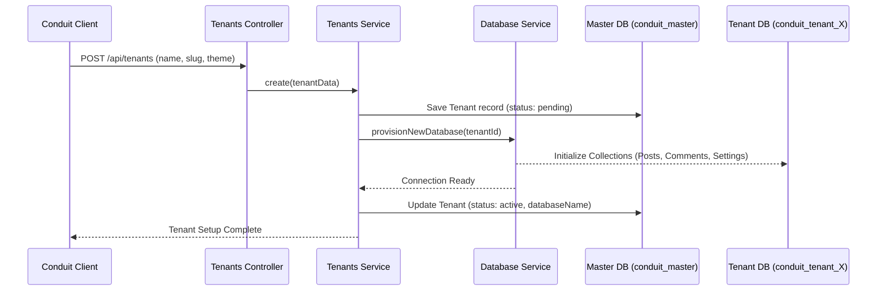
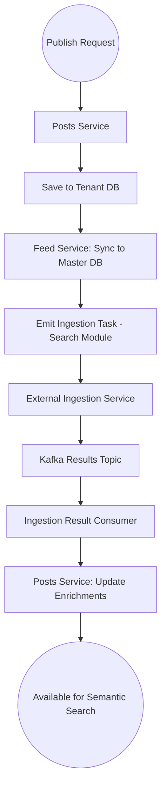

# Backend User Flows — Conduit

This document describes the primary data flows and system interaction paths for Conduit, focusing on backend fulfillment and data orchestration.

---

## 1. Tenant Provisioning Flow (Master to Tenant)
When a creator initializes a new blog, the backend orchestrates the lifecycle from global registration to dedicated database provisioning.



---

## 2. Content Pipeline (Publishing & Enrichment)
The backend manages the transition of content from the tenant isolated stores into the global discovery network.



### 2.1 Backend Fulfillment logic
- **Tiptap Parsing**: The search module extracts plain text from the Tiptap JSON content before sending it to the Ingestion Service.
- **Async Enrichment**: Summaries, entities, and key concepts are patched back into the original tenant post document asynchronously to prevent blocking the UI.

---

## 3. Global Discovery & Aggregation Flow
How the backend aggregates content for the `GET /api/feed` endpoint.

1.  **Request**: Public call to `/api/feed?tag=ronin`.
2.  **Lookup**: `FeedService` queries the `global_feed` collection in the **Master DB**.
3.  **Filtering**: Server-side filtering by tags, author IDs, or hot scores (metrics aggregated from across tenant DBs).
4.  **Response**: Returns minimal metadata (slugs, titles, excerpts) and a `tenantId`. The client uses this `tenantId` to resolve the specific blog for the detailed view.

---

## 4. Scheduled Task Orchestration
Background automation handled by the `SchedulerModule`.

```mermaid
graph LR
    Cron[Every 10 Mins] --> Check[Query Tenant DBs]
    Check --> Filter[Filter: Scheduled & Time Due]
    Filter --> Update[Update status: "published"]
    Update --> Feed[Upsert to Global Feed]
    Feed --> Done((Post Live))
```
