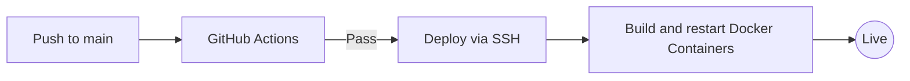

# Infrastructure & Operations — Conduit

## 1. Deployment Pipeline

Conduit utilizes a robust, SSH-native CI/CD pipeline for rapid deployment to cloud environments.

### 1.1 Automated Workflow

---

## 2. Infrastructure Stack

| Component | Technology | Role |
| :--- | :--- | :--- |
| **Runtime** | Docker / Node 22 | Consistent execution environment. |
| **API Gateway** | Nginx | SSL termination & subdomain proxying. |
| **Database** | MongoDB Atlas | Distributed document storage with auto-scale. |
| **Search Engine** | Elasticsearch | Semantic vector store and full-text indexing engine. |
| **Events** | Confluent Kafka | High-throughput asynchronous orchestration. |
| **Assets** | Custom MinIO / S3 | Distributed blob storage for creator media. |

---

## 3. Scaling Strategy

### 3.1 Horizontal Scaling
- **Conduit Core (API)**: Designed as a stateless service. Can be scaled to $N$ instances behind a load balancer.
- **Conduit Frontend**: Optimized for Edge deployment (e.g., Vercel or Cloudflare Workers) for global low-latency delivery.

### 3.2 Database Multi-tenancy
The "Database-per-Tenant" model provides a natural scaling path. As the platform grows, tenant databases can be moved to different sharded clusters without any logic changes in the application layer.

---

## 4. Observability & Monitoring

### 4.1 Logging Architecture
- **Centralized Logs**: Application logs use the NestJS `Logger` and are emitted to `stdout` for aggregation.
- **Audit Trails**: Critical actions (Tenant creation, deletion) are logged with a "Master" privilege level for security auditing.

### 4.2 Health Monitoring
- **Endpoint**: `/api/health` indicates API and DB connectivity status.
- **Kafka Lag**: Monitored via the Ingestion Service dashboard to ensure content enrichment latency remains < 1s.

---

## 5. Security Protocols
- **DDoS Protection**: Cloudflare proxy hides origin IPs and mitigates volumetric attacks.
- **Data Isolation**: Tenant connections are strictly scoped via the `DatabaseService` to prevent cross-tenant data leaks.
- **JWT Integrity**: Tokens are signed with a rotation-capable HS256 secret.
